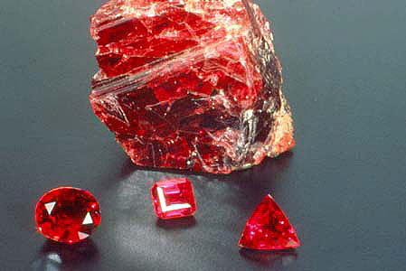
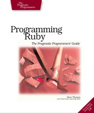
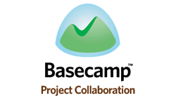
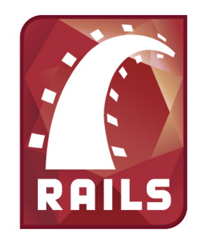

!SLIDE

# The _why of Ruby #

!SLIDE bullets incremental

# Agenda #

* Ruby what?.
* Radar signals.
* Open door to success.
* Lessons from OpenSource.
* Ruby in the enterprise.
* The Polyglot Programmer.

!SLIDE

# What is Ruby? #
## A Programming language. ##

!SLIDE

# What is Ruby? #
## A Programmer's Best Friend. ##

!SLIDE bullets
## A gem from Japan ##

###  ###

* Designed in 1993 by Yukihiro Matsumoto
* First released in 1995 - same year as java -

!SLIDE bullets
## Goals ##
* _The Joy_ of Programming.

!SLIDE bullets
## Goals ##
* Designed for _productivity_ and *fun*.

!SLIDE bullets
## Goals ##
* Lets you _focus_ on *solving* problems.

!SLIDE bullets
## Inspirations ##
### Perl ###
* Embrace the UNIX philosophy.
* Solving every day tasks.
* Server side programming.

!SLIDE bullets
## Inspirations ##
### Lisp ###
* Dynamic, garbage collected lang.
* Evolving language, meta-programming.
* Simple syntax.

!SLIDE bullets
## Inspirations ##
### Smalltalk ###
* Everything is an object. Abstraction.
* Messages - your mind is private.

!SLIDE
## Naturally, creating a gem ##
##  ##
## takes time ##

!SLIDE bullets
## Hidden Treasure ##
* Mostly known in japan.
* Most documentation was in japanese.
* Hard to find available libraries.

!SLIDE bullets
## ruby-talk ##
* 1999 - First english ruby mailing list.
* adventurous hackers realize Ruby exists.

!SLIDE bullets
## Programming Ruby ##
##  ##
* 2000 - First non-japanese doc about Ruby.
* freely available language reference.
* language starts evolving rapidly.

!SLIDE bullets incremenal
## Libraries proliferation ##
* Creation of the Ruby Application Archive.
* C-Extensions, network, OS libraries.
* Net::Http, Webrick, ERB

!SLIDE bullets
## Ruby Gems ##
* 2003 - Centralized ruby library repo.
* Gems - Jar-like software archives.
* Rake - Software construction tool
* RSpec - Behaviour Driven Development

!SLIDE bullets incremental
## 37signals ##
##  ##
* Yet another project management application.
* Built on ruby.

!SLIDE bullets
## Who ever thinked of it? ##
* New technology no one knows nor support.
* No Giant-Corp(tm) behind it.
* Are you serious?

!SLIDE bullets
## 37signals ##
##  ##
* Yeah.. Pretty much
* interested in selling a _Service_

!SLIDE bullets
## Maybe they have to be crazy. ##

* No Risk = No Win

!SLIDE bullets
## There was an oportunity. ##
* Potential niche market.
* Become the driving Force behind it.

### Nothing is as powerful as an idea whose time has come. ###

!SLIDE bullets
## 37signals ##
##  ##
* 2004 fall, the service is launched.
* Rails is _extracted_ from their service.

!SLIDE bullets
## Killer Application ##
##  ##
* Company decides to opensource Rails

!SLIDE bullets
## Going Open ##
* Promote yourself.
* Relevance of blogs, conferences, social net.
* Make a lot of buzz.
* DRY - Don't Repeat Yourself.
* CoC - Convention over Configuration.
* impact the mind of your users.

!SLIDE bullets
## OpenSource ##
##  ##
* Your best qualified member is out there.
* Smart people will come if you attract them.

!SLIDE bullets
## OpenSource ##
##  ##

## Given enough eyeballs, all bugs are shallow. ##
### Linus Law ###

!SLIDE bullets
## OpenSource ##
##  ##
* Inovation happens elsewhere.
* But credit goes always directly to you.

!SLIDE bullets
## OpenSource ##
##  ##

### I'm basically a very lazy person who likes to get credit for things other people actually do. ###

!SLIDE bullets
## Batteries Included ##
##  ##
* Ruby's flexibility allows to explore easily
* Prime time support for the imminent web 2.0 explosion.
* Rails gets polished in all tiers. Front, Middle, Back

!SLIDE bullets
## Maybe they have to be crazy. ##
* How else can you stare at an empty canvas and see a work of art?
* Or sit in silence and hear a song that’s never been written?
* Or gaze at a red planet and see a laboratory on wheels?

##### Apple starts distributing Ruby On Rails with OS X 10 #####
##### becomming the de facto platform for ruby developers  #####

!SLIDE bullets
## 37signals ##
##  ##
* The case of Rails.
* Take new technologies, create new ones.
* A new whole market can get out of it.

!SLIDE bullets
## Google knows this pretty well: ##
### _encourage_ your people to _experiment_ ###
### for fun and profit ###

#### That's why so many people want to work there ####

!SLIDE bullets

## Because the people who are crazy enough to think they can change the world, are the ones who do. ##

!SLIDE
# GitHub #
#  #

## Take the risk ##

!SLIDE bullets
# GitHub #
#  #
* Create an awesome _Service_ around an outstanding _Product_
* Ruby community adopted git right after kernel hackers.
## Git ##

!SLIDE bullets
# GitHub #
#  #

### Use the right tool for the job ###
* Rails - Front end user experience.
* Ruby - Share as much as you can.

!SLIDE bullets
# GitHub #
#  #

### Heroes actually Happen ###
* Hackers become social.
* Learn from others. Be humble.
* Sharing makes you a better person.
* Build an outstanding software career.

!SLIDE bullets
# GitHub #
#  #
* Become an _expert_ in your chosen technology.
## Git ##

!SLIDE bullets incremental
# Success #
* Does Ruby has a chance?
* Others start immitating you.
* Lots of Rails like frameworks.
* Dynamic language proliferation.

!SLIDE bullets incremental
# Big Guys start looking at dynamic languages #
## Sun Microsystems ##
## Microsoft ##
## Apple ##
## Google  ##

!SLIDE bullets
# MacRuby #
* Alternative to Object-C

!SLIDE bullets
# IronRuby #
* 2007 - Microsoft started implementing a .NET Ruby.

!SLIDE bullets
# JRuby #
* 2006 - Sun Microsystems hired core developers to make the JVM the best plarform for ruby.

!SLIDE bullets
# JRuby #
* Pushing the JVM to its limits.
* Java 7 - the Da Vinci Machine project
* 

!SLIDE bullets
# JRuby #
* Best JVM integration for non-java born language
* Java -> Ruby. and Ruby -> Java
* Hybid mode interpreted/Just-In-Time compilation

!SLIDE bullets
# JRuby / IronRuby #
* Best of both: Open and Enterprise world.
* Deploy Rails apps on any Application Container.

!SLIDE bullets
# Ruby in the software industry #
* Lots of agil ruby shops.
* Talented unnoticed programmers grow up
* and become successful enterpreneur

!SLIDE bullets incremental
# The Polyglot Programmer #
* Is German better than English?
* They are tools that help you _grow_.
* How many human languages in your CV?
* How about programming languages?

!SLIDE bullets
# Programming Languages #
* Help you realize you can _think differently_.
* _Improve_ the way you _solve_ problems.

!SLIDE bullets
# Become a better programmer #
* Even if you don't use them on a daily basis
* Crazy geek stuff

## Lisp, Haskell, Erlang ##

!SLIDE bullets
# The Polyglot Programmer #
* At least one programming language a year.

## Python, Ruby - both a must these days ##
## Scala, Clojure - replacements for java lang #
## F#, Go - Functional programming ##
## Objective-C - iPad, Mac Platform ##

!SLIDE bullets
# The Passionate Programmer #
* Being passionate about what you do
* is important.
* Do what you love. Love what you do.

!SLIDE bullets
# Questions? #

!SLIDE bullets incremental
# Questions? #
* How passionate are you ?
* Do you really love what you do ?
* Would you like be exceptional ?

!SLIDE bullets incremental
# Stay tunned in #
* In comming talks ...
* The OpenSource Revolution
* How to become a Hacker
* The Ruby Programming Language
* JRuby / Buildr.

!SLIDE bullets
# Thanks! #

